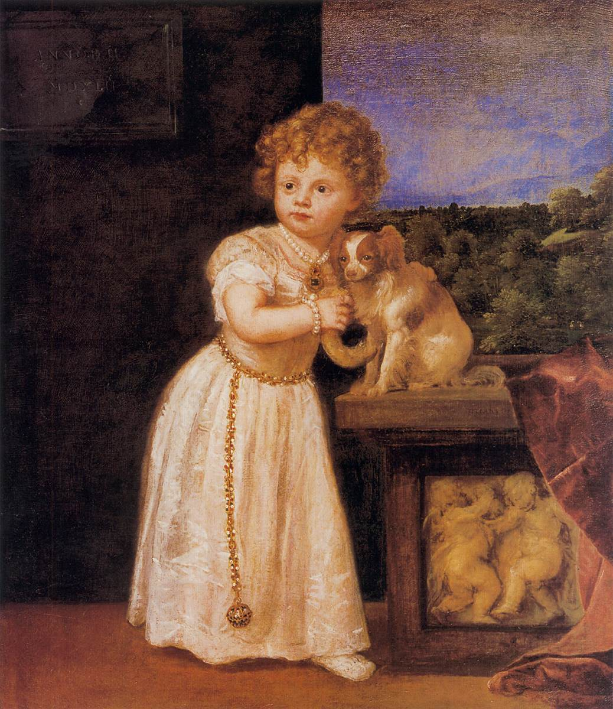

# Georgie, the Phalène Codex Pet

Georgie is a silent focus buddy for Codex. He is a Phalène, the drop-eared variety of the Continental Toy Spaniel. The erect-eared variety is called Papillon. He stays close while you work and offers a small paw when you need a pause.

This pet is for people who work better with a little comfort, support, and momentum nearby. Georgie is neurodivergent-friendly.

## What Georgie does

- Keeps a calm presence during focused work.
- Offers a small paw lift instead of a loud reaction.
- Brings a little company to long or difficult tasks.

## Install

1. Clone or download this repository.
2. Copy the georgie-phalene-codex-pet folder to your Codex pets folder.

   - Windows: C:\Users\your-name\.codex\pets\
   - macOS: ~/.codex/pets/
   - Linux: ~/.codex/pets/

3. Restart Codex and select Georgie from your pet picker.

## Animation work

Read [AGENTS.md](AGENTS.md) and [the Georgie animation skill](skills/georgie-animation/SKILL.md) before you change the sprite sheet. The state matrix defines every action, frame sequence, scale, baseline, and release check.

Run `just check` before you install or publish a new sprite sheet. Do not repair individual atlas cells.

## About Phalènes

Phalènes are the drop-eared variety of the Continental Toy Spaniel. The exact origin is uncertain. Related toy spaniels appear in European portraits from the 16th century. France and Belgium both shaped the breed's development. The erect-eared variety is called Papillon. [The Papillon Club of America has the fuller history.](https://papillonclub.org/articles-a-brief-history-of-the-papillon/)

### A 1542 portrait

Titian's *Portrait of Clarissa Strozzi* shows a small drop-eared spaniel. [The Papillon Club of America lists it among the artistic predecessors of the modern Papillon.](https://papillonclub.org/papillons-in-art/) The work is public domain. [Image source and record](https://commons.wikimedia.org/wiki/File:Titian_-_Portrait_of_Clarissa_Strozzi_-_WGA22926.jpg).

## License

MIT. See [LICENSE](LICENSE).
